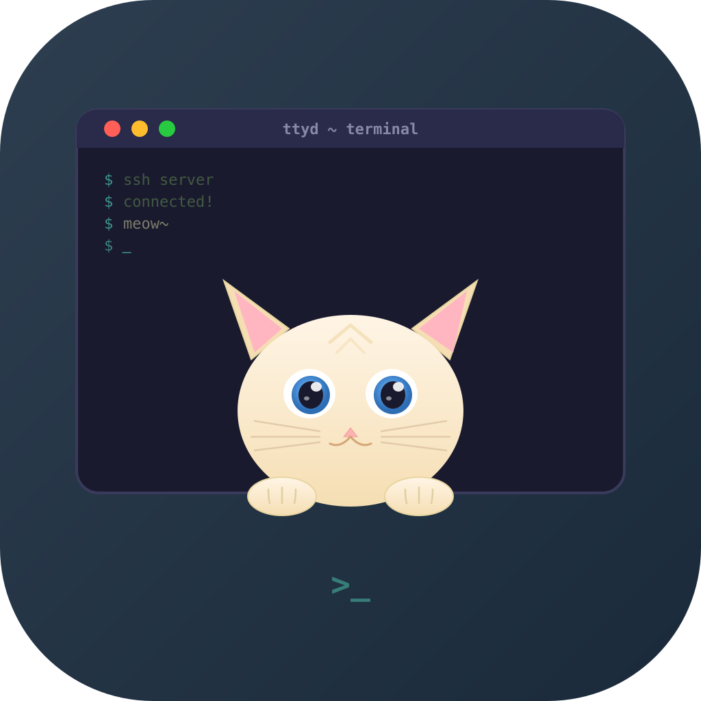

<p align="center">
  
</p>

<h1 align="center">TermCAsT</h1>
<p align="center"><strong>Your Terminal, Anywhere.</strong></p>
<p align="center">
  Access your computer's terminal from your iPhone.<br>
  End-to-end encrypted. One QR scan to pair.
</p>

<p align="center">
  <a href="https://apps.apple.com/app/termcast"></a>
  <a href="https://github.com/ulixcode-labs/termcast_server/raw/main/bin/termcast_server.dmg"></a>
</p>

<p align="center">
  <a href="https://github.com/ulixcode-labs/termcast_server/actions/workflows/scan-binary.yml"></a>
</p>

---

## How It Works

```
📱 iPhone  ←——🔒 E2E encrypted——→  ☁️ Relay  ←——🔒 E2E encrypted——→  💻 Your Computer
```

Three steps. Zero config. No port forwarding. No VPN. No firewall rules.

### 1. Install the server

```bash
curl -fsSL https://ttyd-relay.xing-mathcoder.workers.dev/install.sh | bash
```

Works on macOS, Linux, and WSL. Auto-detects platform and installs everything.

### 2. Scan the QR code

```bash
termcast start
```

A QR code appears in your terminal (or at `localhost:8080` for headless setups). Open the Termcast iOS app and scan it.

### 3. You're connected

Full terminal on your iPhone. E2E encrypted. Auto-reconnects. Remembers your pairing.

---

## Desktop App

For Mac users who prefer a GUI, the **Termcast Desktop** app lives in your menu bar:

- Start/stop the server from the tray
- Show QR code with one click
- Launch at login
- Prevent sleep while serving

[Download for macOS](https://github.com/ulixcode-labs/termcast_server/blob/main/bin/Termcast-0.1.0-arm64.dmg)

---

## iOS App Features

| Feature | Details |
|---------|---------|
| **End-to-End Encryption** | X25519 key exchange + ChaCha20-Poly1305. The relay sees only opaque blobs — never your terminal data. |
| **First-Class tmux** | Swipe between tmux windows. Dedicated shortcut bar for splits, new windows, and detach. Auto-resume sessions. |
| **Real Keyboard** | Esc, Ctrl, Tab, arrow keys from a dedicated toolbar. Ctrl+C, Ctrl+Z, and tmux prefix shortcuts on tap. |
| **Auto-Reconnect** | Switch apps, lock your phone, walk to another room. Termcast reconnects automatically when you come back. |
| **Pinch to Zoom** | Read logs comfortably on any screen size. Zoom in and out of terminal content smoothly. |
| **Customizable** | Choose your font, size, and cursor style. Per-connection settings so each server feels right. |

---

## Server CLI Options

```
termcast start [options]
```

| Option | Default | Description |
|--------|---------|-------------|
| `-r, --relay <url>` | Termcast relay | Relay server URL |
| `-p, --port <port>` | `7681` | Local ttyd port |
| `-w, --web-port <port>` | `8080` | Web UI port (QR code viewer) |
| `-s, --shell <shell>` | `$SHELL` | Shell to use |
| `--no-tmux` | | Disable auto tmux session |

Generate a new QR code while the server is running:

```bash
termcast qr
```

## Platform Support

| Platform | Architecture |
|----------|-------------|
| macOS | Apple Silicon (arm64), Intel (x64) |
| Linux | x64, arm64 |
| WSL | x64, arm64 |

---

## Security

[](https://github.com/ulixcode-labs/termcast_server/actions/workflows/scan-binary.yml)

Every binary release is automatically scanned by **6 independent security checks** before distribution. We believe in transparency — you shouldn't have to trust us, you should be able to verify.

### Automated Security Scans

| Status | Scanner | What it does |
|--------|---------|-------------|
| [](https://github.com/ulixcode-labs/termcast_server/actions/workflows/scan-binary.yml) | **Trivy** (Aqua Security) | Scans all bundled dependencies and libraries against the National Vulnerability Database (NVD) for known CVEs. Also detects accidentally leaked secrets, API keys, or credentials embedded in the binary. |
| [](https://github.com/ulixcode-labs/termcast_server/actions/workflows/scan-binary.yml) | **Grype** (Anchore) | A second, independent vulnerability scanner that cross-references against Anchore's own vulnerability database. Running two scanners ensures no known vulnerability slips through the cracks. Fails the build on any critical severity finding. |
| [](https://github.com/ulixcode-labs/termcast_server/actions/workflows/scan-binary.yml) | **OSV-Scanner** (Google) | Queries Google's Open Source Vulnerabilities database, which aggregates advisories from GitHub, PyPI, npm, and 15+ ecosystems. Catches vulnerabilities that other scanners may miss. |
| [](https://github.com/ulixcode-labs/termcast_server/actions/workflows/scan-binary.yml) | **ClamAV** (Cisco) | Industry-standard open-source antivirus engine. Scans the binary for malware, trojans, viruses, and other malicious signatures using continuously updated virus definitions. |
| [](https://github.com/ulixcode-labs/termcast_server/actions/workflows/scan-binary.yml) | **Apple Codesign Verify** | Verifies the app is signed with a valid Developer ID certificate and has been notarized by Apple. Apple notarization means Apple has scanned the binary and confirmed it is free of known malicious content. macOS Gatekeeper will allow this app without warnings. |
| [](https://github.com/ulixcode-labs/termcast_server/actions/workflows/scan-binary.yml) | **SHA-256 Checksum** | Generates cryptographic checksums for every release. You can verify the integrity of your download matches exactly what was built — ensuring nothing was tampered with in transit. |

> All scans run automatically on every binary update. Results are publicly visible in the [Actions tab](https://github.com/ulixcode-labs/termcast_server/actions/workflows/scan-binary.yml).

### Built-In Security

- **Zero-knowledge relay** — your terminal data is encrypted before it leaves your device. The relay routes messages but can never decrypt them.
- **End-to-end encryption** — X25519 key exchange + ChaCha20-Poly1305. Military-grade cryptography protects every keystroke and every byte of output.
- **Hardware-backed crypto** on iOS with Keychain storage. Keys never leave the Secure Enclave.
- **Forward secrecy** — fresh ephemeral keys on every connection. Even if a key is compromised, past sessions remain private.
- **Code obfuscation** — all application code is obfuscated with control flow flattening, dead code injection, and string encryption. Reverse engineering is extremely difficult.
- **No accounts, no telemetry, no tracking.** We don't collect any data. Period.

---

## Links

- [Website](https://termcast.pages.dev)
- [iOS App](https://apps.apple.com/app/termcast)
- [Desktop App](https://github.com/ulixcode-labs/termcast_server/raw/main/bin/termcast_server.dmg)

## License

MIT
